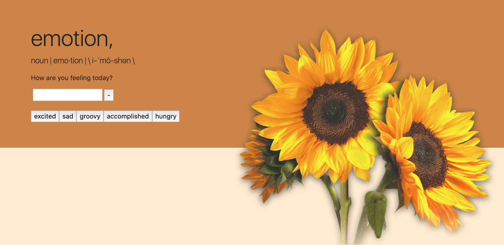

# GifTastic
GIF generator

By using the API Key from Giphy I have created dynamically generated buttons that source the images from Giphy.com to display each time 
the user clicks the button, with option to add their own button and browse the search engine.

Each click generates a limited 10 gifs [manually] all in which are displayed via 'gif-rating', Each button shows a different 'subject' of Gif's.
All gif's are animated when you click the image. Clicking again will pause the gif.

// Psuedocode notes put throughout to understand functionality of specific areas of code. //

<a href="https://blonded.github.io/GifTastic/" alt="DEMO"> "DEMO" </a>

Installing
Download repository on GitHub, open in preferred text editor to view source code (i.e. Atom, Sublime, Visual Studio Code). Open index.html, style.css, and app.js. Right click on the html file code and select "view in default browser" to view a demo of the website created. (Google Chrome Preferred for viewing)

index.html
style.css
gif.js
javascript  /folder
css         /folder
assets      /folder
images      /folder
LICENSE
README.md

Sample of code used:

Javascript, dynamically generating classes through js - and running code through the AJAX call, while including the api key in order to 
collect the information to display the GIF's wanted. 

''''''
     

        .......

        function displayEmotions() {
    var emotion = $(this).attr("data-name");
    var queryURL = "https://api.giphy.com/v1/gifs/search?q=" +
        emotion + "&api_key=sZR5ZpCqMPKZXVX0X6IphpQPULnfT8eJ&limit=10";

$.ajax({
    url: queryURL,
    method: "GET"
}).then(function(response){

var emotionDiv = $("
");  

var results = response.data;

for (var i = 0; i < results.length; i++) {

  var gifDiv = $("
");

  var rating = results[i].rating;

var p = $("
").text("Rating: " + rating);

  var emotionImg = $("");

emotionImg.attr("src", results[i].images.fixed_height_still.url);
emotionImg.attr("data-still", results[i].images.fixed_height_still.url);
emotionImg.attr("data-animate", results[i].images.fixed_height.url);
emotionImg.attr("data-state", "still");
emotionImg.attr("class", "gif");

  emotionImg.attr("src", results[i].images.fixed_height_still.url);

  emotionDiv.prepend(p);

  emotionDiv.prepend(emotionImg);

  $("#emotions-view").prepend(emotionDiv);
    }
  })
} 

'''''

## Built With

* [html]
* [css]
* [javascript]
* [jQuery]
* [bootstrap]
* [JSON - API Key]

## Authors

* **Lena Blonded** - *Github* - [Github](https://github.com/Blonded)
* **Google Fonts** - *GoogleFonts* - [Google Fonts](https://fonts.google.com/)
* **BootStrap** - *Bootstrap* - [BootStrap](https://getbootstrap.com/)
* **GIPHY** - *Giphy* - [Giphy](https://giphy.com/)

